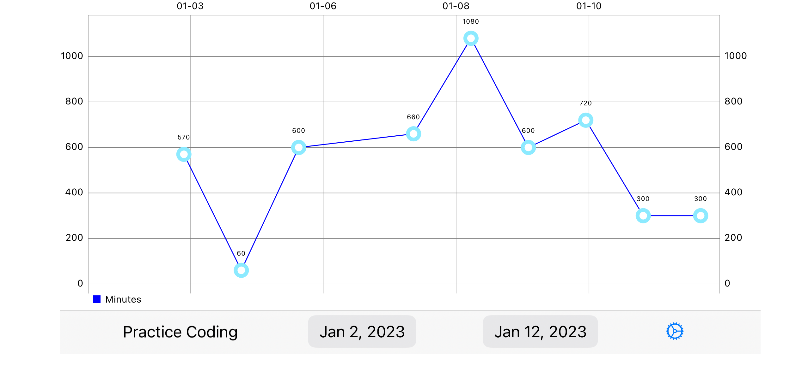

HabitifyReport
====

HabitifyReport is a WIP iOS app to help visualize data from the [Habitify](https://www.habitify.me/) app.  Habitify has a bunch of great features for habit tracking, e.g. a variety of useful units (reps, time, distances, quantities) and the ability to track over different time periods (do a habit daily, 2x a week, etc.)  It also allows tracking of undesirable habits (don't eat too much sugar, etc.)  It's visualization of the data leaves something to be desired, but they expose a REST api.

Example chart: 

It would have been easiest to build a Jupyter notebook for visualization, but this was an opportunity for me to get some Swift practice in including networking with async/await.

Framework Decisions
----
### Charts
https://github.com/danielgindi/Charts

Apple has released a [charts api](https://developer.apple.com/documentation/charts) that seems pretty great, but it requires iOS 16. It's rare to work on projects that can target the newest Apple iOS version, so I fell back to a third party Charts library.

The Charts library has a decent set of features and mostly did what I needed.  It does not support dates, so I needed to hack something up for that -- primarily using unix time as the value seen by Charts and truncating the date components based on the needed granularity.

### Misc
Most of the libraries I used in a previous project and talked about the motivations there:  https://github.com/shimpanzee/ScalePlayer/blob/main/README.md

    https://developer.apple.com/documentation/combine
    https://github.com/hmlongco/Factory
    https://github.com/CombineCommunity/CombineCocoa
    https://github.com/roberthein/TinyConstraints/

I also used the [SwiftDate](https://github.com/malcommac/SwiftDate) library to help with truncating date components.

Additional Notes
---
Just a simple prototype at this point. Next up would be features like combining multiple habits into a single graph, changing granularity (e.g. group by day, week, month), chart interactivity for things like drilldowns into the data (what actually happened at a given data point, e.g. are there notes?)

